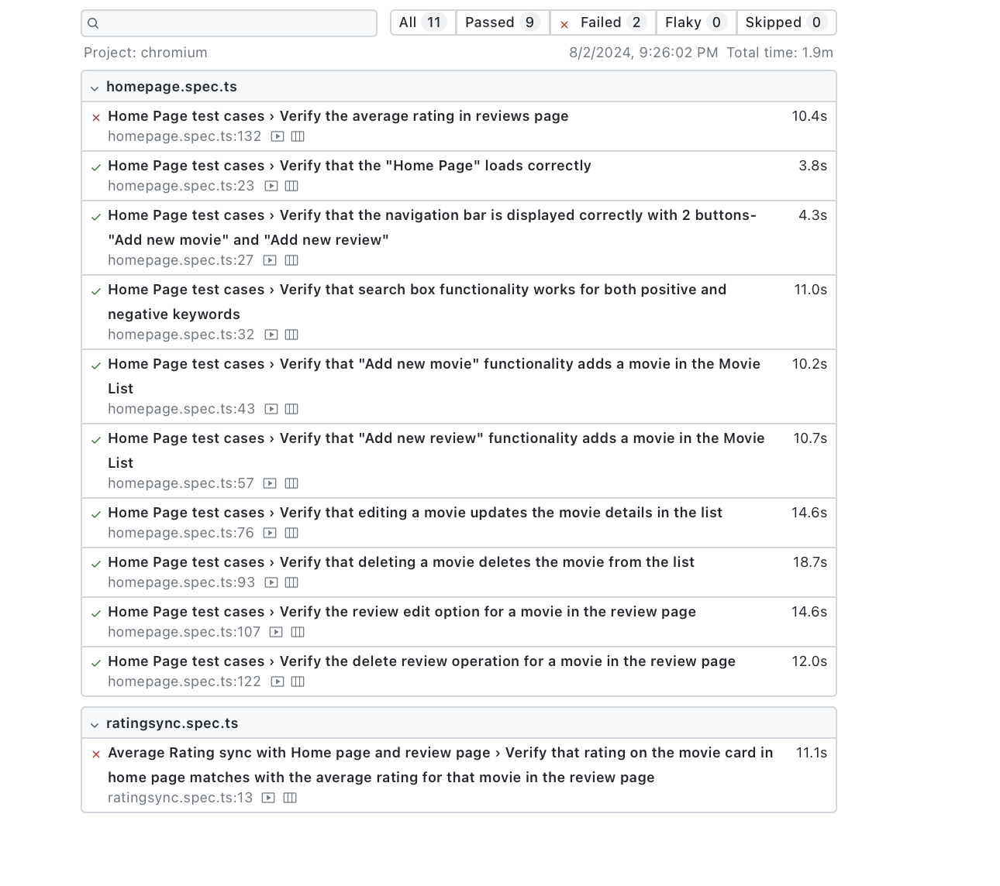

Hi Everyone,

Install- npm init playwright@latest

to run the automation suite-- "npx playwright test --project=chromium --headed"  [This would run in chromium in headed mode]

Pre-requisites:

1. Movie "testing" should be available in the application
2. Movie "falseeeeeeeee" and "Titanic" shouldn't be available in the application
3. Movie named "do not delete" should be available in the application along with more than 1 review.

Comments:
1. There are total 11 test cases where multiple individual checks are done in respective test cases.
2. out of 11 test cases, 2 will fail. The failed test cases are:-
    a. Verify the average rating in reviews page -- functional issue-- expected to fail
    b. Verify that rating on the movie card in home page matches with the average rating for that movie in the review page. -- functional issue-- expected to fail

